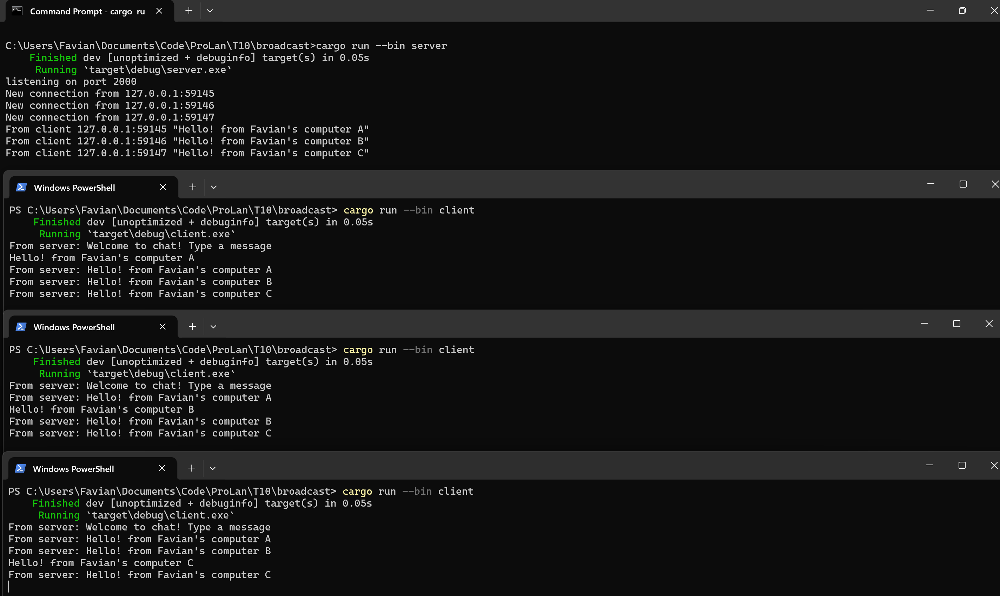

# Tutorial 10 - Timer

Favian Naufal - **2006597802**

## Information
This tutorial is based on the part of the Rust book:  
https://google.github.io/comprehensive-rust/concurrency/async-exercises/chat-app.html 
Along with the solution:  
https://google.github.io/comprehensive-rust/concurrency/async-exercises/solutions.html

To run the program:
- Clone this repository: `git clone https://github.com/Sylphiann/T10-BroadcastChat.git`
- Navigate into the codebase, for windows: `cd T10-BroadcastChat`
- Run the program: 
    - Run the server program: `cargo run --bin server`
    - Run the client program: `cargo run --bin client`

## Reflection

### **Experiment 2.1: Original code, and how it run**

What happens when the server program was run, followed with running three program of the clients

As we can see here, the server accepts incoming connection from multiple clients. Then for any messages coming from any clients, the message would then be broadcasted to all clients that are connected to the server, including the sender of the message themselves. Thus why this program is called Broadcaster chat, as it follows the concept of Broadcast design pattern.